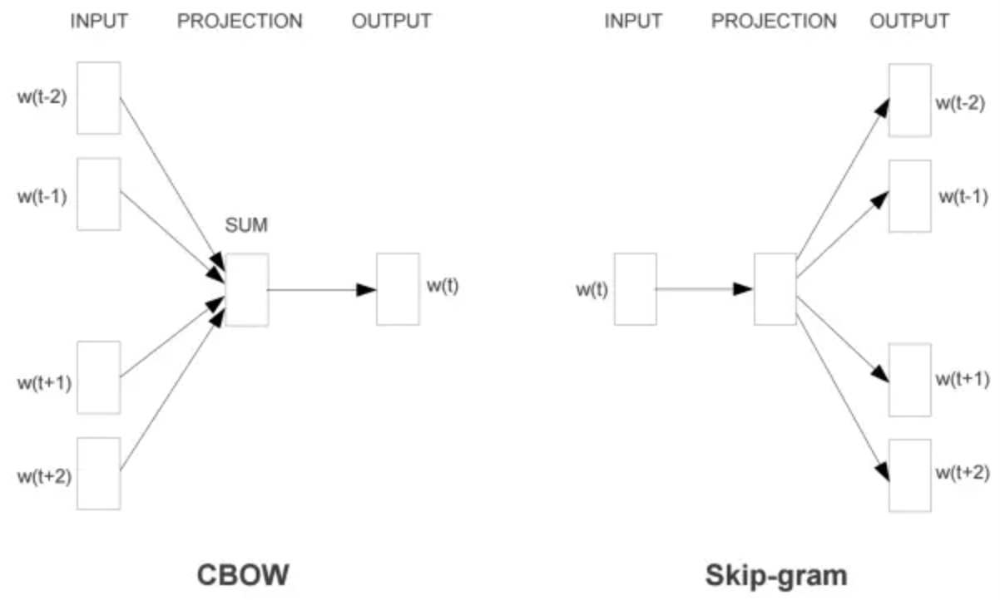

## 1. word2vec

### 1.1 基础网络结构

是一个二层网络，后一层是一个多分类损失函数

实现时有两种基础的网络模型：CBOW 与 Skip-gram

CBOW对小型数据库比较合适，而Skip-Gram在大型语料中表现更好

由于词向量采用one-hot编码，为了解决网络参数稀疏性问题，word2vec对这个模型做了改进。

- 首先，对于从输入层到隐藏层的映射，没有采取神经网络的线性变换加激活函数的方法，而是采用简单的对所有输入词向量求和并取平均的方法。

- 第二个改进就是从隐藏层到输出的softmax层这里的计算量个改进。为了避免要计算所有词的softmax概率，word2vec采样**霍夫曼树来代替从隐藏层到输出softmax层的映射，或者采用负采样的方式一次只更新少数的神经元**。

### 1.2 学习目标与embedding生成

模型训练时的训练目标是根据上下文预测中间词，或者根据中间词预测上下文，但实际上应用最多的是利用训练好的中间层W矩阵作为映射矩阵，从而生成词向量embedding表示。

ont-hot编码的特点，**在矩阵相乘的时候，就是选取出矩阵中的某一行，而这一行就是我们输入这个词语的word2vec表示！**

### 1.3 Hierarchical Softmax

参考：https://zhuanlan.zhihu.com/p/56139075

参考：https://www.cnblogs.com/pinard/p/7243513.html

来源自SVM中的哈夫曼树多分类的方法

本质是根据词建立哈夫曼树对词典中的每一个词进行01编码，

使用霍夫曼树有什么好处呢？首先，由于是二叉树，之前计算量为V,现在变成了log2V（即原来每次梯度更新都需要更新全部的节点，现在只需要更新log2V个节点）。第二，由于使用霍夫曼树是高频的词靠近树根，这样高频词需要更少的时间会被找到（即高频词需要的概率连乘比较少，最终的求导操作涉及到的节点更新较少），这符贪心优化思想。

需要对 $\theta$ 以及$X$ 进行梯度更新，$\theta$ 实在更新隐藏层到输出层的权重矩阵，$X$ 在更新embedding层的权重矩阵。

### 1.4 负采样

原文：https://www.cnblogs.com/pinard/p/7249903.html

Hierarchical Softmax的的缺点：如果我们的训练样本里的中心词𝑤w是一个很生僻的词，那么就得在霍夫曼树中辛苦的向下走很久了。能不能不用搞这么复杂的一颗霍夫曼树，将模型变的更加简单呢？

以CBOW举例

有一个训练样本，中心词是𝑤w,它周围上下文共有2𝑐2c个词，记为𝑐𝑜𝑛𝑡𝑒𝑥𝑡(𝑤)。由于这个中心词𝑤,的确和𝑐𝑜𝑛𝑡𝑒𝑥𝑡(𝑤)相关存在，因此它是一个真实的正例。通过Negative Sampling采样，我们得到neg个和𝑤不同的中心词𝑤𝑖,𝑖=1,2,..𝑛𝑒𝑔，这样𝑐𝑜𝑛𝑡𝑒𝑥𝑡(𝑤)和𝑤𝑖就组成了neg个并不真实存在的负例。利用这一个正例和neg个负例，我们进行二元逻辑回归，得到负采样对应每个词𝑤𝑖对应的模型参数𝜃𝑖，和每个词的词向量。

从上面的描述可以看出，Negative Sampling由于没有采用霍夫曼树，每次只是通过采样neg个不同的中心词做负例，就可以训练模型，因此整个过程要比Hierarchical Softmax简单。

1）如果通过一个正例和neg个负例进行二元逻辑回归呢？ 

其实还是抛弃了多分类softmax，利用的neg+1个logistic进行的连乘，使似然函数最大化

2） 如何进行负采样呢？

使用 一元模型分布 (unigram distribution) 来选择 negative words，一个单词被选作 negative sample 的概率跟它出现的频次有关，出现频次越高的单词越容易被选作negative words，经验公式为：

具体采样如何实现呢？总不可能把每一词的概率算出来排序吧，那哪里是采样，具体操作当然是用随机数啦，用概率的方法选择概率较大的，这才是采样嘛～

## 2. Item2Vec Doc2vec node2vec

## 3. 双塔模型

​    在完成双塔模型的训练后，可以把最终的用户Embedding和广告Embedding存入内存数据库。而在线上inference时，也不用复现复杂网络，只需要实现最后一层的逻辑（即线上实现LR或浅层NN等轻量级模型拟合优化目标），再从内存数据库中取出用户Embedding和广告Embedding之后，通过简单计算即可得到最终的预估结果。

​    在这张图中，用户embedding和物品embedding不是在同一个特征空间中的，最后在最后一层组合起来进行最终的CTR预估的

遗留问题：

- 用户embedding如何得到？除了简单的行为平均. https://www.zhihu.com/question/336110178
- 用户画像如何与embedding结合？
- 用户画像如何得到 如何预测用户画像
- 推荐都是推荐一个已经存在的物品，如果是生成就是另外一个领域了，应该先考虑推荐，就像现在做的这个样子

### 3.1 Youtube DNN

知乎专题：https://zhuanlan.zhihu.com/p/52504407

- user embedding 与 item embeddin在同一空间的解释

这个DNN输入的特征是<user, context>类的特征，及根据用户每次刷新的状态去输入到网络中得到的最后一层的向量作为user vector，可以做到实时反馈，每次最新的浏览点击都能反馈到输入层进而得到不同的user vector。

而video vector则是Softmax中video与**最后一层的w**(即output embedding还是onehot查表)作为这个video的vector，最终通过**user_vec与item_vec的内积最大索引**就能快速得到结果

模型最后一层隐层就是user embedding，通过u*v得到vedio的概率，v就是vedio embedding，只不过这里用来作为softmax层的权重w

训练的时候，softmax概率最大的那个对应最大的user*video向量内积。预测的时候直接计算内积，没必要再softmax计算概率了。训练和预测表示统一，所以不存在不同空间问题。

### 3.2 DSSM

user embedding

item embedding

数学原理全套：https://www.cnblogs.com/peghoty/p/3857839.html

图嵌入是将图结构转化为低维向量，大多数是基于图结构的学习

GNN是一种基于图特征的表示学习，在图结构的基础上加入了对图节点信息的表示

